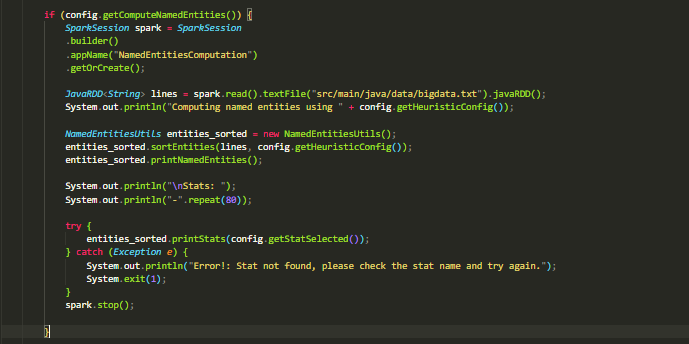
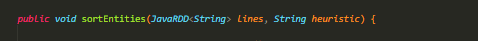
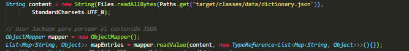
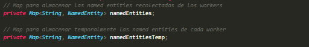
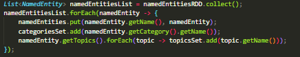
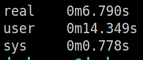
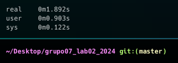

# Laboratorio 3 - Paradigmas de la Programacion
# **"Computacion Distribuida con Apache Spark"**

## Autores
- Bruno Storani
- Alexis Ortiz
- Ezequiel Marin Reyna

## Indice

- [Introduccion](#introduccion).
- [Implementacion](#implementacion).
- [Compilacion](#compilacion).
    - [Instalacion de SPARK](#instalacion-de-spark-).
    - [Inicializacion del cluster](#inicializacion-de-cluster-).
    - [Compilacion en maven](#compilacion-en-maven-).
- [Cambios Respecto al Laboratorio 2](#cambios-respecto-al-laboratorio-2).
    - [Cambios en NamedEntitiesUtils.java](#cambios-en-namedentitiesutilsjava).
- [Dificultades que tuvimos en el Laboratorio](#dificultades-que-tuvimos-en-el-laboratorio).
- [Punto Estrella](#puntos-estrella).
- [Conclusion sobre el trabajo de SPARK](#conclusion-sobre-el-trabajo-de-spark).
- [Experiencia con el Laboratorio](#experiencia-con-el-laboratorio).

## Introduccion

En este proyecto, abordaremos cómo computar y agilizar la tarea de extraer entidades nombradas de un texto de tamaño considerable. Si mantenemos la metodología implementada en el laboratorio anterior, el proceso será lento, lo cual es lo último que deseamos. Por lo tanto, utilizaremos la "computación distribuida", que consiste en dividir una tarea grande en tareas más pequeñas y distribuir el trabajo entre diferentes computadoras.

El framework que emplearemos para esto es "Apache Spark", que implementa una arquitectura de Master-Slaves, funcionando de la siguiente manera:

>"Tiene una única computadora 'MASTER' y k-computadoras 'SLAVES'. Esto configura lo que se denomina un clúster de Spark y funciona de la siguiente manera: el usuario envía una petición de cómputo al master, y este se encarga de dividir el big data entre los slaves. Los slaves, a su vez, procesan su partición asignada. Finalmente, cuando todos los slaves han terminado, el master recopila las soluciones parciales de cada slave para devolver al usuario la solución completa."

Esta estructura nos permitirá manejar grandes volúmenes de datos de manera eficiente, acelerando significativamente el proceso de extracción de entidades nombradas.

## Implementacion 

Esto lo logramos dentro de la clase App, cuando es ingresado por el usuario el argumento "-ne" para computar las entidades nombradas:

Donde: 
- **"SparkSession spark = SparkSession.builder().appName("NamedEntitiesComputation").getOrCreate();" :** Crea una nueva sesión de Spark con el nombre de aplicación "NamedEntitiesComputation". Si ya existe una sesión de Spark con ese nombre, la reutiliza.

    - ".builder()" : Para definir el patron de diseño Builder (Usado para construir objetos paso a paso).
    - ".appName("")" : Metodo para asignarle Nombre a la App.
    - "getOrCreate()" : Metodo para tomar una sesion que se inicio antes o crearla en caso contrario.

- **"JavaRDD<String> lines = spark.read().textFile("src/main/java/data/bigdata.txt").javaRDD();" :** Leemos el archivo de texto llamado bigdata.txt y lo convertimos en un JavaRDD de lineas de texto. (Esta conveniencia la explicamos en [Cambios Respecto al Laboratorio 2](#cambios-respecto-al-laboratorio-2)).

- **"NamedEntitiesUtils entities_sorted = new NamedEntitiesUtils();
entities_sorted.sortEntities(lines, config.getHeuristicConfig());" :** Creamos una instancia de NamedEntitiesUtils y utilizamos meotodo sortEntities para ordenar las entidades nombradas en lines, segun la heuristica especificada en la configuracion. Una vez realizado imprimimos las entidades con printNamedEntities();

- **Bloque try :** Imprimimos las estadisticas segun como se seleccione en la configuracion.

- **"spark.stop();" :** Detenemos la sesion de Spark.

Osea que, con respecto al laboratorio 2, lo que vamos a agregar sera el inicio de una sesion de Spark.

## Compilacion

Esta es la parte mas engorrosa, asi que vamos a explicarla detalladamente para que nada pueda salir mal.

### Instalacion de SPARK :

1. Descargar Apache Spark (spark-3.5.1-bin-hadoop3.tgz) del sitio : https://spark.apache.org/downloads.html.
 
2. Descomprimir el archivo descargado en algún directorio de su disco (${SPARK_FOLDER}).

### Inicializacion de cluster :

1. Instalamos spark.

2. Nos ubicamos en spark/conf : `cd spark/conf`

3. Copiamos el template para la configuracion y lo llamamos spark-env.sh : `cp spark-env.shtemplate spark-env.sh`

4. Añadimos nuestras configuraciones, en este caso, para tener dos workers :

    `echo "SPARK_WORKER_CORES=2" >> spark-env.sh`

    `echo "SPARK_WORKER_INSTANCES=2" >> spark-env.sh`

    `echo "SPARK_WORKER_MEMORY=2g" >> spark-env.sh`

5. Nos ubicamos en spark/sbin y creamos el master : `./start-master.sh`

6. Vamos a "http://localhost:8080" (puede que tengas que agregar una s, ya que en la barra de busqueda quiza aparezca localhot:8080).

7. Copiamos URL y creamos los workers con `./start-worker.sh "URL" -m 1G -c 1` (tambien en sbin).

### Compilacion en Maven :

1. Instalar maven con `maven install`.

2. Dentro de la carpeta "grupo07_lab3_2024/my-app" ejecutar `maven clean package` (Eso debera crearte el .jar en target, para inspeccionarlo `jar tf Lab03g07-01.jar` dentro de la carpeta target).

3. Dentro de my-app compilar empleando submit de la siguiente forma :

    `./{SPARK_HOME}/bin/spark-submit --class App --master URL_SPARK {JAR_PATH} ARGS 2>/dev/null`

    Donde: 
    - **SPARK_HOME** es donde se encuentra la carpeta de SPARK.
    - **URL_SPARK** es el URL que propicia el framework a la hora de inicializar el cluster.
    - **JAR_PATH** es el path hacia el .jar que crea maven.
    - **ARGS** son los argumentos (igual al lab 2).
    - **2>/dev/null** para direccionar el output de spark a null.

    **Ejemplo de uso :**

    `./../../spark-3.5.1-bin-hadoop3/bin/spark-submit --class App --master spark://darkaraus-System-Product-Name:7077 ../../grupo07_lab03_2024/my-app/target/Lab03g02-0.1.jar -ne capitalized`

## Cambios Respecto al Laboratorio 2 

- **Modularizacion en App.Java :**
    - Creacion de lista de articulos mediante ArticleListMaker.java.

    - Matcheo de Heuristicas en makeHeuristic.java (para no reutilizar tanto codigo).

    - HelpPrinter.java emplear la funcion print help.

    - FileMaker.java para crear el archivo.

- **Uso de Jackson en NamedEntitiesUtils.java :**
    - Debido a la necesidad de SPARK de serializar la informacion antes de distribuirla a las computadoras, tuvimos que reemplazar objetos JSON ya que no son Serializables.

    - Utilizacion de ObjectMapper (es la clase principal de Jackson que proporciona funcionalidades para leer y escribir JSON).

    - De JSONArray o JSONObject a Lists, Map, etc. 

- **Uso de JavaRDD en vez de List para el uso de Spark :** 
    - >Clase fundamental en Apache Spark, que es un marco de trabajo para el procesamiento de datos en paralelo. RDD significa Resilient Distributed Dataset. Es una colección de elementos que pueden ser procesados en paralelo.

    - JavaRDD es repartido entre los workers creados para trabajar paralelamente sobre el.

    - Una vez obtenidos todos los datos, los reunimos con .collect().          

- **Los articles, pueden escribir su descripcion en un archivo de texto**
    - Esto para construir el bigdata sobre el cual va a trabajar el Master y sus Workers.
    - Esto se hace mediante `List<Article> articles = FeedParser.parseXML(contenido);` en ArticleListMaker, FeedParser y Article.

- **Uso de implement Serializable en algunas clases :**
    - Por lo ya mencionado en el primer inciso de "Uso de Jackson ..." tuvimos que agregarlo en las siguientes clases : NamedEntitiesUtils.java, JSONParser.java, Category.java, Topics.java, NamedEntity.java y makeHeuristic.java.  

### Cambios en NamedEntitiesUtils.java
--- 
Este archivo fue en el que mas tuvimos que trabajar, principalmente para solventar el problema de la serializacion anteriormente explicada. 

Los primero que hicimos fue cambiar los argumentos de sortEntities, ya que cambiamos nuestra implementacion de las heuristicas y debemos emplear JavaRDD para usar SPARK. 

Luego, los objetos JSON tuvieron que irse y fueron reemplazados con el fin de Serializar:

donde :
- **Content :** Donde guardamos el JSON del diccionario.
- **ObjectMapper :** Se explica en el apartado "Uso de jackson..." de la parte anterior
- **mapEntries :**  Utilizamos el metodo readValue de ObjectMapper para deserializar los datos JSON contenidos en la variable content en una estructura de datos de Java. Esto para utilizar los datos del diccionario como objetos en java.

Ahora, y esto es lo mas importante, a medida que avanzamos en el laboratorio nos dimos cuenta de algo importante, nuestros campos privados que utilizabamos para guardar toda la informacion que extraimos de las entidades nombradas son propios de cada worker. Esto supone un problema debido a que la informacion recopilada se pierde al finalizar el cuerpo del programa.
Por lo que creamos, un hashmap temporal para cada worker.

Ahora, ¿Como obtenemos toda la informacion para almacenarla en namedEntities?, bueno, aqui todos los datos recaudados se almacenan en namedEntitiesRDD, por lo que podemos guardar toda la informacion que se encuentra alli utilizando .collect().

Tambien, para mejorar la comprension del codigo, cambiamos nombres de variables y quitamos algunas como "found".

## Dificultades que tuvimos en el Laboratorio

- **Comprender el funcionamiento de Maven** para poder compilar el laboratorio. Creábamos el proyecto, compilábamos con `mvn clean package`, obteníamos el archivo .jar, pero no se encontraba la clase App. Al tratar de solucionar esto, identificamos que podríamos tener alguno de los siguientes problemas:

    - La ruta al archivo JAR es incorrecta.
    - La clase App no estaba en el paquete especificado.
    - El archivo JAR no tiene la clase App.

    También intuimos que el pom.xml (archivo para definir la configuración del proyecto y gestionar las dependencias) estaba incompleto o mal hecho.

- **Creacion un cluster con dos workers**, al principio pensabamos que simplemente ejecutando dos veces el comando de creacion de un worker "./start-worker.sh" era suficiente, cuando nos dimos cuenta de que no era asi, estuvimos bastante rato pensando e investigando sobre como llevar esto a cabo.

- **Uso de la API de spark**, ya que nunca trabajamos con ella, investigar sus metodos nos llevo un tiempo.

- **Adaptar el código para el uso de Spark** fue una tarea ardua y compleja. Si bien Spark tiene sus propios requerimientos de trabajo, no anticipamos tener que hacer un cambio tan drástico para satisfacer las necesidades del framework.
    - El hecho de no considerar cómo interactuaban el maestro y los trabajadores con nuestras variables privadas de la clase incrementó significativamente la dificultad del laboratorio, ya que fue en este aspecto donde más nos encontramos con obstáculos.

## Punto estrella (Medicion de tiempo)

### En spark:
---

### En el laboratorio 2:
--- 

La diferencia radica en que Spark está haciendo un gran trabajo con un archivo de bigdata.txt relativamente pequeño (junta de los feeds). Esto es algo que el código implementado en el proyecto anterior podría manejar con mayor facilidad.

Sin embargo, si estuviéramos trabajando con un archivo más grande, nuestra última implementación tendría un tiempo de procesamiento menor gracias a la computación en paralelo que ofrece el framework.

## Conclusion sobre el trabajo de SPARK

Con los resultados obtenidos tras testear nuestra implementacion 
Llamemos :

- *spark_time* = Header de correr el programa con spark es un tiempo constante.
- *local_run* = Retardo de nuestro programa corriendolo localmente como en el lab2  que es proporcional a la cantidad de palabras que tenga la big data que estamos tratando.
- *workers_run* : tiempo que tarda los workers en realizar el trabajo que se va a llamar(este tiempo es proporcional a la cantidad de workers) 

Con todo esto podemos armar algo cercano a una ecuacion de tiempo teniendo a **n como tamaño de texto**.

### Archivos chicos 
--- 
**Laboratorio 2 :**
>*local_run* * n

**Laboratorio 3 :** 
>*spark_time* + *workers_run* * n/(variable proporcional a cantidad de workers)

Ese tiempo costante del spark_time hace que el trabajo demore mas que el lab2 porque aunque el tiempo actual de trabajo es menor ese header por la preparacion y funcionamiento de spark lo hace mas lento.

### Archivos grandes
--- 
**Laboratorio 2 :** 
>*local_run* * n^3

**Laboratorio 3 :** 
>*spark_time* + *workers_run* * n^3/(variable proporcioanl a cantidad de workers)

Algo digno de mencionar es que teniendo un archivo considerablemente mas grande **el overhead de spark sigue constante** pero el trabajo es mucho menor en comparacion, ya que la computacion se divide en los workers.

## Experiencia con el Laboratorio

A pesar de todo obstáculo, consideramos que fue un laboratorio muy satisfactorio de realizar. Cada problema que resolvimos nos proporcionó un entendimiento más profundo de cómo funciona la computación distribuida y cómo aprovechar las capacidades de Apache Spark. Finalmente, logramos implementar un sistema eficiente para extraer entidades nombradas de grandes volúmenes de texto, lo que fue un logro significativo para nuestro equipo. La experiencia nos dejó mejor preparados para enfrentar proyectos futuros que requieran la manipulación y análisis de big data.